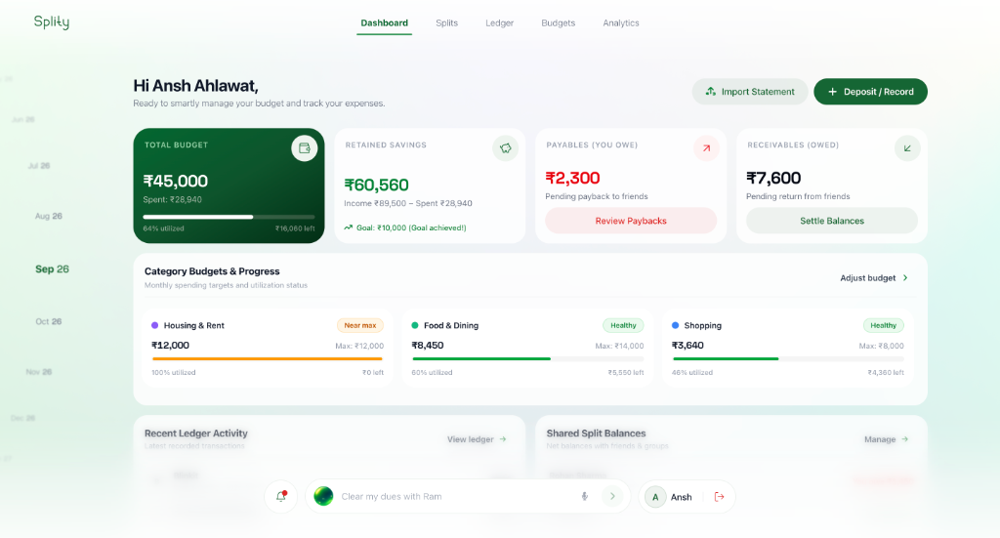
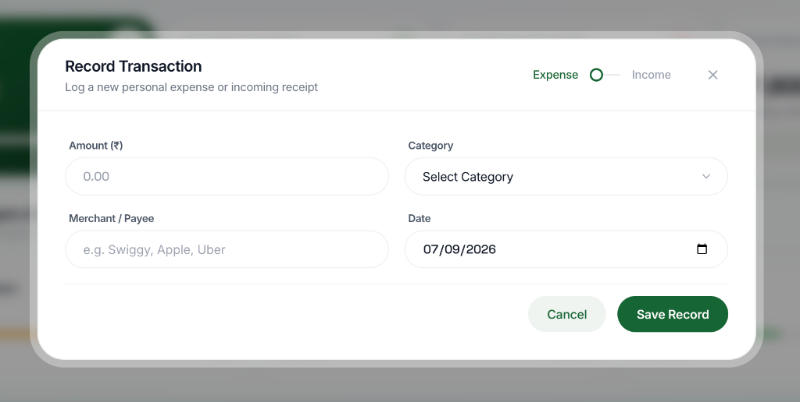

<div align="center">

# Splity — Personal & Shared Finance Tracker

**A finance tracker with category budgeting, group expense splitting, an AI copilot for spending questions, and client-side PDF receipts.**

[](https://www.typescriptlang.org/)
[](https://react.dev/)
[](https://tailwindcss.com/)
[](https://nodejs.org/)
[](https://vitejs.dev/)
[](https://ai.google.dev/)

### 🔗 Live: [splity-oa5o.onrender.com](https://splity-oa5o.onrender.com/)

</div>

---

## What it is

I built Splity because most expense trackers either just log transactions and stop there, or bury useful insight behind a dozen menus. This one tracks spending against category budgets that actually warn you before you go over, splits shared bills and works out who owes who automatically, and has a copilot you can just ask things like *"can I afford a laptop next month?"* instead of doing the math yourself.

---

## Screenshots

**Dashboard** — category budgets, monthly savings, split balances at a glance



**AI Copilot** — plain-English or voice queries about your spending


**Add transaction** — quick capture with categories, custom merchants, dates



---

## Features

**Budgeting** — five default categories (rent, food, shopping, transport, entertainment) plus custom ones, each with a progress bar that shifts green → yellow → red as you close in on the limit. A monthly retention number shows how much of what came in actually got saved.

**AI copilot** — type or speak a question. Simple lookups (a date, a category total) resolve instantly without an API call; anything needing real reasoning about spending patterns gets routed to Gemini.

**Group splits** — create a group, split a bill evenly or by custom shares, and the app nets out balances automatically across everything shared. One tap to settle up.

**PDF receipts** — every transaction can generate a receipt as a PDF, rendered entirely client-side, styled like a modern digital receipt with a barcode and a hash.

**Auth** — email/password with scrypt-hashed passwords and JWT sessions, or Google sign-in via Firebase. A one-click demo login drops you into an account pre-loaded with a few months of sample data.

---

## Stack

| Layer | Tech |
|---|---|
| Frontend | React 19, TypeScript, Tailwind v4, Recharts, Framer Motion |
| Backend | Node.js, Express, TypeScript |
| AI | Google Gemini API (`@google/genai`) |
| Build | Vite 6, esbuild |

---

## Project structure

```text
Splity/
├── public/ # static assets — fonts, images, the copilot orb video
├── screenshots/ # README screenshots
├── server/
│ ├── middleware/ # auth middleware
│ ├── services/ # auth, budget, category, friendGroup,
│ │ # import, notification, report,
│ │ # smartSearch, transaction
│ ├── crypto.ts # password hashing + JWT signing/verification
│ ├── db.ts # flat-file JSON data store
│ └── gemini.ts # Gemini API client
├── src/
│ ├── api/ # HTTP client wrapper
│ ├── components/ # shared UI components
│ ├── context/ # auth + date React contexts
│ ├── lib/firebase.ts # Google OAuth setup
│ ├── pages/ # one component per screen
│ ├── utils/ # PDF generation, etc.
│ └── types.ts # shared TS types
├── .env.example
├── data_store.example.json # clean seed data — real data_store.json is gitignored
├── package.json
├── tsconfig.json
├── vite.config.ts
└── server.ts # Express entrypoint  
```

---


## Running it locally

**Prerequisites:** Node 20+, npm 10+

```bash
git clone https://github.com/ahlawatansh/Splity.git
cd Splity
npm install
cp .env.example .env
```

Fill in `.env`:
- `GEMINI_API_KEY` — from [Google AI Studio](https://aistudio.google.com/)
- `JWT_ACCESS_SECRET` / `JWT_REFRESH_SECRET` — any random 64-character hex string (`openssl rand -hex 32` twice). The server won't boot without these — on purpose.

```bash
npm run dev      # Express + Vite with HMR, http://localhost:3000
```

Production build:
```bash
npm run build
npm start
```

If `data_store.json` doesn't exist, the app seeds itself automatically from `data_store.example.json`.

---

## API

| Method | Endpoint | Description |
|---|---|---|
| `POST` | `/api/auth/login` | Log in with email & password |
| `POST` | `/api/auth/signup` | Create an account |
| `POST` | `/api/auth/demo-login` | One-click demo account |
| `GET` | `/api/transactions` | Fetch transactions, filterable by month/category |
| `POST` | `/api/transactions` | Log a new transaction |
| `GET` | `/api/budgets/categories` | Get category budgets & current utilization |
| `POST` | `/api/budgets/categories` | Set a category's spending limit |
| `POST` | `/api/smart-search` | Query the AI copilot |
| `POST` | `/api/reports/generate` | Generate a Gemini-written monthly summary |
| `GET` | `/api/friends/debts/summary` | Net balances across friends |
| `POST` | `/api/friends/debts/settle` | Record a settlement |

---


<div align="center">
<sub>Built by <a href="https://github.com/ahlawatansh">Ansh Ahlawat</a> · CSE undergrad, VIT Vellore</sub>
</div>
